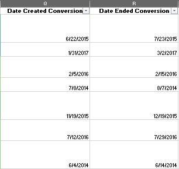
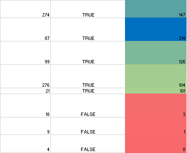
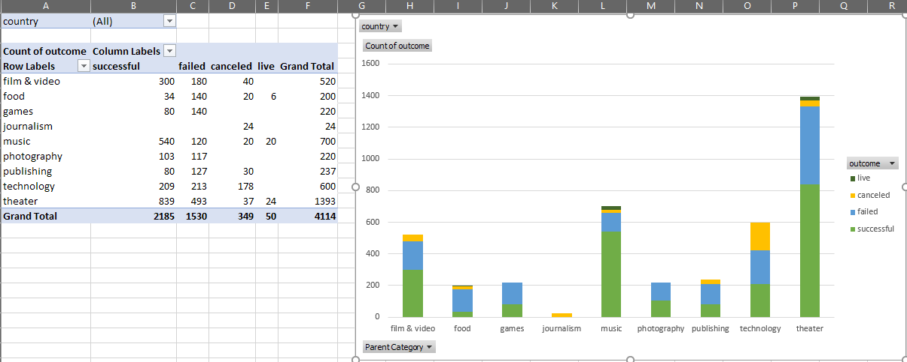
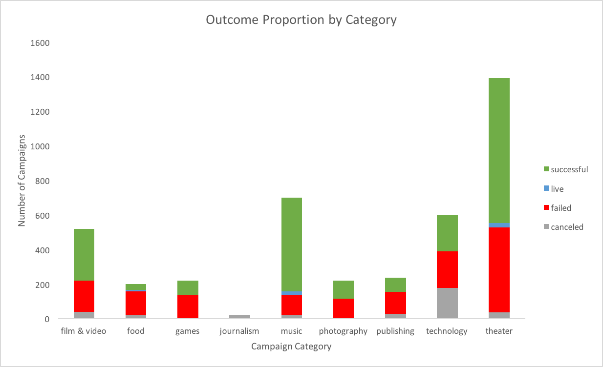
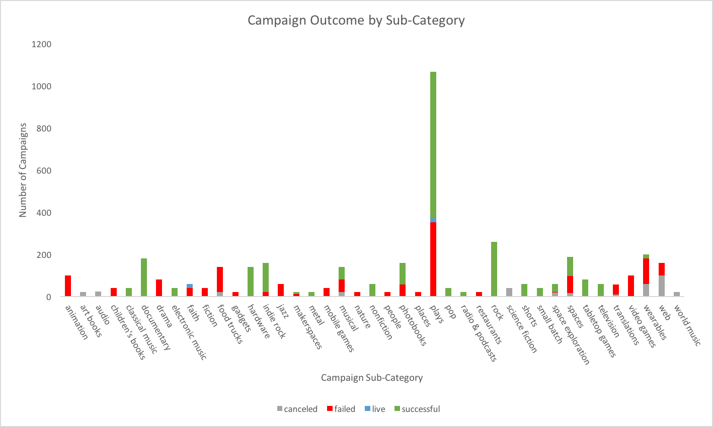
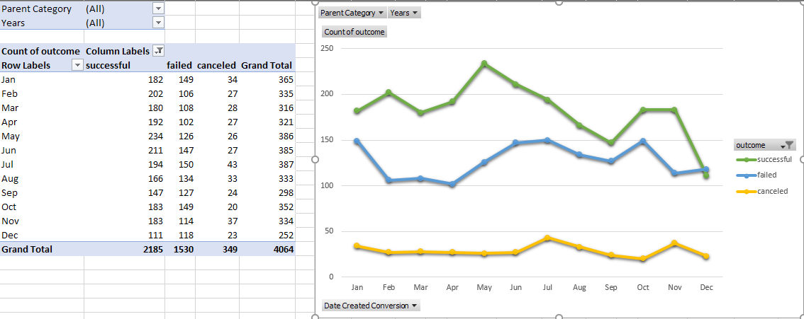
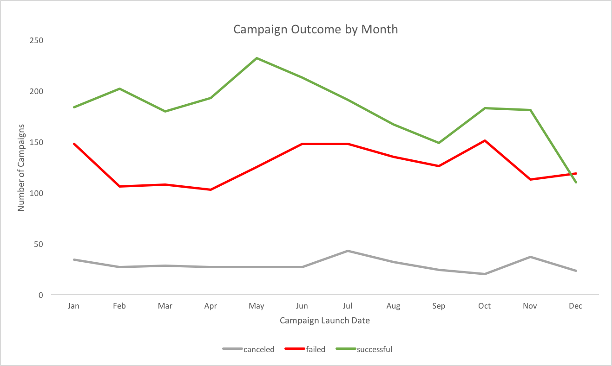
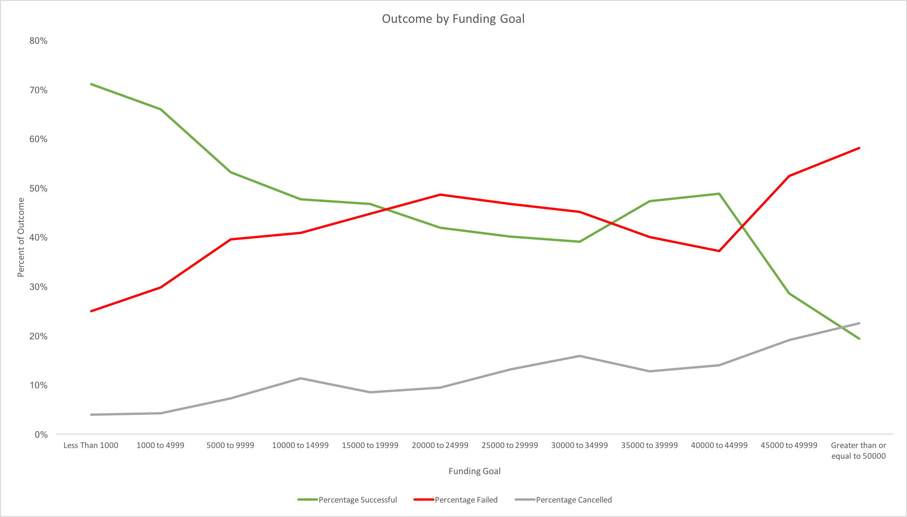

# Kickstarter Analysis
## What makes a successful Kickstarter campaign?
Over two billion dollars have been raised using the massively successful crowdfunding service, Kickstarter, but not every project has found success. Of the over 300,000 projects launched on Kickstarter, only a third have made it through the funding process with a positive outcome.

Since getting funded on Kickstarter requires meeting or exceeding the project's initial goal, many organizations spend months looking through past projects in an attempt to discover some trick to finding success. Here I organize and analyze a database of four thousand past projects in order to uncover any hidden trends.

### Data Structure
The dataset is an Excel spreadsheet of four thousand rows, each row representing a kickstarter project. Columns include project name, description, amount pledged, pledge goal, whether the project was successful, when it started and ended, etc.

## Data Preparation
### Deriving new columns using formulas
1. In order to make sense of how successful each project was, an additional calculated column, `percent funded`, was created to calculate how much money a campaign made towards reaching its initial goal.

2. In order uncover how much each backer for the project paid on average, a new calculated column, `average donation`, was created.

3. The `Category and Sub-Category` column consisted of a category and subcategory in one field, delimited by a backslash. In order to better group the campaigns, this column was split into two, `parent-category`, and `sub-category`.

4. `launched_at` and `deadline`, the start and end times for each campaign, are using UNIX timestamps. In order to convert these to Excel's datetime format, two new columns were created, `Date Created Conversion` and `Date Ended Conversion`. Formulas were applied to convert each column.

### Conditional Formatting
In order to make the spreadsheet more readable, two columns were color-coded:
* `outcome`, depending on whether the associated campaign was "successful" (green), "failed" (red), "cancelled" (yellow), or is currently "live" (blue)
* `percent funded`, which used a three-color scale, transitioning from red, to green, and finally to blue, if the campaign exceeded its funding goal.

## Analysis
### Do some campaign categories perform better than others?
In order to answer this question, a pivot table was created to count how many campaigns were "successful", "failed", "cancelled", or are currently "live" per **category**.

A stacked column pivot chart, filterable by `country`, was chosen to represent the data visually:

Based on the analysis, we can see:
* Theater is the largest category for Kickstarter campaigns
* Journalism, food, games, and publishing all have low rates of success
* Music has a high success rate 

### Which campaign subcategories perform best? Worst?
To answer this question, another pivot table was created to count how many campaigns were "successful", "failed", "cancelled", or are currently "live" per **sub-category**.

Another stacked column pivot chart, filterable by `country` and `parent-category`, was created to drill down to higher specificity:

Based on the analysis, we can see:
* Plays outnumber other campaigns by a wide margin
* Documentary, hardware, and rock stand out as categories that have both relatively high campaign numbers and very low fail rates
* Animation, food trucks, and video games rank among categories with a near 100% fail rate

### Do campaigns perform better at certain times of the year?
In order to assess monthly trends in campaign performance, a pivot table was created to compare "successful", "failed", and "cancelled" outcomes over time. Filters were added based on `parent-category` and `Years`.

A line graph was chosen to represent the data visually:

Based on the analysis, we can see:
* Higher success rates across all campaigns in May
* Lower failure rates in April
* Highest cancellation rates in July

### How does fundraising goal affect success?
In order to assess the affect of fundraising goal on campaign success, a new table was created to bin campaigns into fundraising goal ranges (`Goal`). The following columns were then calculated using a `COUNTIFS()` formula on the original data:
* `Number Successful`
* `Number Failed`
* `Number Cancelled`
* `Percentage Successful`
* `Percentage Failed`
* `Percentage Cancelled`
* `Total Projects`

A line graph was chosen to represent the data visually:

Based on the analysis, we can see:
* In general, success declines with increasing funding goal size
* Asking $40,000-50,000 will give higher success rates than every other goal above 1000

## Dataset limitations
In the context of predicting successful trends, the dataset has the following limitations:

* Limited sample size
* Lack of information on individual pledge datetimes and amounts
* Lack of data past March 2017
* Lack of information on average number of visits to Kickstarter website during campaign periods

## Future directions
Ideas for other analyses:

* A plot showing campaign success probability (successful ÷ (failures + cancellations)) for category, subcategory, and launch date
* A winner-take all series of visualizations that showed the best category, subcategory, and time of year to launch a campaign for the highest chance of success
* A series of small multiples for each of the included visualizations filtered by:
    * Year
    * Category
    * Subcategory
    * A series of graphs comparing the effect of spotlighting or no spotlighting
    * A graph showing success and failure rate by:
        * campaign length
        * Goal amount
* Plots could be altered to reflect the amount of goal funded, rather than just whether it was successful, failed, or cancelled. This would remove the distortion inherent in summarizing percent funded with the outcome.
* Plots could be filtered by country to look at additional differences between countries

## Report
A word document report was created discussing outcomes, Kickstarter_Analysis_Report.docx

